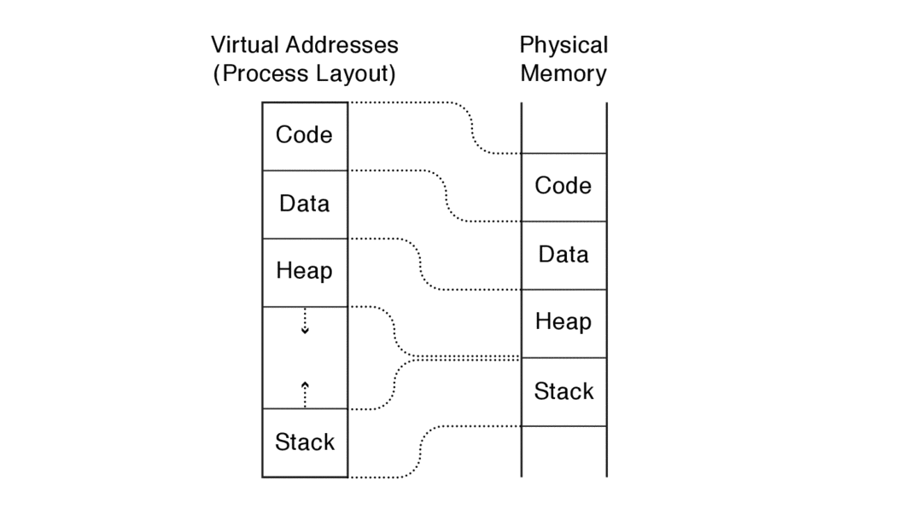

# The Kernel Abstraction
User-level and kernel-level operation. The operating system kernel is trusted to arbitrate between untrusted applications and users.

When reading this chapter, keep these two perspectives in mind: when we are running the operating system kernel, it can do anything; when we are running an application process on behalf of a user, the process’s behavior is restricted.

## 2.1The Process Abstraction
To run the program, the operating system copies the instructions and data from the executable image into physical memory. The operating system sets aside a memory region, ***the execution stack***, to hold the state of local variables during procedure calls. The operating system also sets aside a memory region, called the ***heap***, for any dynamically allocated data structures the program might need.

Of course, to copy the program into memory, the operating system itself must already be loaded into memory, with its own stack and heap.

A process is an instance of a program, in much the same way that an object is an instance of a class in object-oriented programming. 

The operating system keeps track of the various processes on the computer using a data structure called the ***process control block***, or PCB. 

As parallel computers became more popular, though, we once again needed a word for a logical sequence of instructions. A multiprocessor program can have multiple instruction sequences running in parallel, each with its own program counter, but all cooperating within a single protection boundary. For a time, these were called ***“lightweight processes"*** (each a sequence of instructions cooperating inside a protection boundary), but eventually the word ***“thread”*** became more widely used.

This leads to the current naming convention used in almost all modern operating systems: a process executes a program, consisting of one or more threads running inside a protection boundary.

## 2.2Dual-Mode Operation
How does the operating system kernel prevent a process from harming other processes or the operating system itself?

Instead of the processor directly executing instructions, a software ***interpreter*** would fetch, decode, and execute each user program instruction in turn. Before executing each instruction, the interpreter could check if the process had permission to do the operation in question: is it referencing part of its own memory, or someone else’s? Is it trying to branch into someone else’s code? Is it directly accessing the disk, or is it using the correct routines in the operating system to do so? The interpreter could allow all legal operations while halting any application that overstepped its bounds.

Can we modify the processor in some way to allow safe instructions to execute directly on the hardware?

To accomplish this, we implement the same checks as in our hypothetical interpreter, but in hardware rather than software. This is called ***dual-mode operation***, represented by a single bit in the processor status register that signifies the current mode of the processor. In ***user mode***, the processor checks each instruction before executing it to verify that it is permitted to be performed by that process. (We describe the specific checks next.) In ***kernel mode***, the operating system executes with protection checks turned off.

```
The kernel vs. the rest of the operating system

Why not include the entire operating system — the library code and any user-level processes — in the kernel itself?

one reason is that it is often easier to debug user-level code than kernel code. The kernel can use low-level hardware to implement debugging support for breakpoints and for single stepping through application code; to single step the kernel requires an even lower-level debugger running underneath the kernel. The difficulty of debugging operating system kernels was the original motivation behind the development of virtual machines.
```


Figure 2.4 shows the operation of a dual-mode processor; the program counter and the mode bit together control the processor’s operation. In turn, the mode bit is modified by some instructions, just as the program counter is modified by some instructions.

What hardware is needed to let the operating system kernel protect applications and users from one another, yet also let user code run directly on the processor? At a minimum, the hardware must support three things:

- ***Privileged Instructions.*** All potentially unsafe instructions are prohibited when executing in user mode. 

- ***Memory Protection.*** All memory accesses outside of a process’s valid memory region are prohibited when executing in user mode.

- ***Timer Interrupts.*** Regardless of what the process does, the kernel must have a way to periodically regain control from the current process.

```
The processor status register and privilege levels

Some processor architectures, including the Intel x86, support more than two privilege levels in the processor status register (the x86 supports four privilege levels). The original reason for this was to allow the operating system kernel to be separated into two layers: (i) a core with unlimited access to the machine, and (ii) an outer layer restricted from certain operations, but with more power than completely unprivileged application code. This way, bugs in one part of the operating system kernel might not crash the entire system. However, to our knowledge, neither MacOS, Windows, nor Linux make use of this feature.
```
### 2.2.1 Privileged Instructions
Instructions available in kernel mode, but not in user mode, are called ***privileged instructions***.

What happens if an application attempts to access restricted memory or attempts to change its privilege level? Such actions cause a ***processor exception***. Unlike taking an exception in a programming language where the language runtime and user code handles the exception, a processor exception causes the processor to transfer control to an exception handler in the operating system kernel. Usually, the kernel simply halts the process after a privilege violation.

If an application can jump past the permission check, it could potentially evade the kernel’s security limits.

### 2.2.2 Memory Protection


With this approach, a processor has two extra registers, called ***base and bound***. The base specifies the start of the process’s memory region in physical memory, while the bound gives its endpoint (Figure 2.5). These registers can be changed only by privileged instructions, that is, by the operating system executing in kernel mode. User-level code cannot change their values.

Every time the processor fetches an instruction, it checks the address of the program counter to see if it is between the base and the bound registers.

The operating system kernel executes without the base and bound registers, allowing it to access any memory on the system — the kernel’s memory or the memory of any application process running on the system. 

```
Memory-mapped devices

On most computers, the operating system controls input/output devices — such as the disk, network, or keyboard — by reading and writing to special memory locations. Each device monitors the memory bus for the address assigned to it, and when it sees its address, the device triggers the desired I/O operation.

The operating system can use memory protection to prevent user-level processes from accessing these special memory locations.

```

Disadvantages of physically addressed base and bound registers:

- ***Expandable heap and stack.*** Most programs today need at least two regions of memory that need to expand independently during execution:***Heap*** and ***Stack***. Modern operating systems often grow the stack and heap in opposite directions within the program's allocated memory.
- ***Memory sharing.*** Different processes which running the same program or using the same library can not share code between each other.  
- ***Physical memory addresses.*** For relative address of the procedure and global variables, each program is loaded into physical memory at runtime and must use those physical memory addresses. since a program may be loaded at different locations depending on what other programs are running at the same time, the kernel must change every instruction and data location that refers to a global address, each time the program is loaded into memory.
- ***Memory fragmentation.*** ***Relocation*** of a program is difficult once it has started, because of the need to update pointers and other memory references, which is complex and error-prone.***Memory fragmentation*** occurs as programs are started and stopped, and over time, memory becomes fragmented into small, non-contiguous blocks. Even though there may be enough free memory in total, fragmentation can prevent new programs from being allocated memory because they might require a ***single contiguous block*** of memory that doesn't exist anymore.

For these reasons, most modern processors introduce a level of indirection, called ***virtual addresses***.

Virtual addresses can also let the heap and the stack start at separate ends of the virtual address space so they can grow according to program need.



```
Address Randomization 

Most operating systems, such as Linux, MacOS, and Windows, combat viruses by randomizing (within a small range) the virtual addresses that a program uses each time it runs. This is called address space layout randomization. 
```
### 2.2.3 Timer Interruption
Operating system should regain the control of process when needed.

Almost all computer systems include a device called a ***hardware timer***, which can be set to interrupt the processor after a specified delay (either in time or after some number of instructions have been executed).

## 2.3 Types of Mode Transfer

For switch between user mode and kernel mode thousands of times per second, the mechanism must be both safe and fast.

### 2.3.1 User to Kernel Mode

There are three reasons for the kernel to take control from a user process: interrupts, processor exceptions, and system calls. Interrupts occur asynchronously-that is, they are triggered by an external event and can cause a transfer to kernel mode after any user-mode instruction.

- ***Interrupts*** An *interruption* is am asynchronous signal to the processor that some external event has occurred that may require its attention. If an interrupt has arrived, processor completes or stalls any instructions that are in progress. The process hardware saves the current execution state and starts executing a designated interrupt handler in the kernel. Each different type of interrupt requires its own handler. An alternative to interrupts is ***polling***: the kernel loops, checking each input/output device to see if an event has occurred that requires handling. Needless to say, if the kernel is polling, it is not available to run user-level code.

```
Buffer descriptions and high-performance I/O

Early computer systems: the key to good performance was the processor busy.
Today computer systems: the kry is keeping I/O devices, such as network and disk device, busy.
The operating system sets up a circular queue of requests for each device to handle.Each entry in queue, called a buffer descriptor, specifies ont I/O operation: the requested operation and the location of the buffer to contain the data.The device hardware reads the buffer descriptor to determine what operations to perform.

Buffer descriptions are stored in memory, accessed by the device using DMA(direct memory access).
```

- ***Process exception.*** A processor exception is a hardware event caused by user program behavior that causes a transfer of control to the kernel. 
```
Processor exception and virtualization

As one example, it is common for different versions of a processor architecture family to support some parts of the instruction set and not others.When the program issues a floating point instruction, an exception is raised, trapping into the operating system kernel. Instead of halting the process, the operating system can emulate the missing instruction, and, on completion, return to the user process at the instruction immediately after the one that caused the exception. In this way, the same program binary can run on different versions of the processor.
More generally, processor exceptions are used to transparently emulate a virtual machine.These privileged instructions will cause processor exceptions, trapping into the host operating system kernel.
This allows the kernel to treat memory as virtual — a portion of the program memory may be stored on disk instead of in physical memory. When the program touches a missing address, the operating system exception handler fills in the data from disk before resuming the program. In this way, the operating system can execute programs that require more memory than can fit on the machine at the same time.
```

- ***System calls.*** 
User processes can also transition into the operating system kernel voluntarily to request that the kernel perform an operation on the user’s behalf. A ***system call*** is any procedure provided by the kernel that can be called from user level. Most processors implement system calls with a special `trap` or `syscall` instruction.
When the kernel completes the system call, it resumes user-level execution at the instruction immediately after the trap.

### 2.3.2 Kernel to User Mode
- ***New process.***
- ***Resume after an interrupt, process exception or system call.***
- ***Switch to a different process.***
- ***User-level upcall.***

## 2.4 Implementing Safe Mode Transfer
To avoid confusion and reduce the possibility of error, most operating systems have a common sequence of instructions both for entering the kernel — whether due to interrupts, processor exceptions or system calls — and for returning to user level, again regardless of the cause.

At a minimum, this common sequence must provide:
- ***Limited entry into the kernel.***

- ***Atomic changes to processor state.*** Transitioning between the two is atomic — the mode, program counter, stack, and memory protection are all changed at the same time.

- ***Transparent, restartable execution.***

### 2.4.1 Interrupt Vector Table


The processor has a special register that points to an area of kernel memory called the ***interrupt vector table***. The interrupt vector table is an array of pointers, with each entry pointing to the first instruction of a different handler procedure in the kernel. An ***interrupt handler*** is the term used for the procedure called by the kernel on an interrupt.

### 2.4.2 Interrupt Stack
On most processors, a special, privileged hardware register points to a region of kernel memory called the interrupt stack. When an interrupt, processor exception, or system call trap causes a context switch into the kernel, the hardware changes the stack pointer to point to the base of the kernel’s interrupt stack. The hardware automatically saves some of the interrupted process’s registers by pushing them onto the interrupt stack before calling the kernel’s handler.

When the kernel handler runs, it pushes any remaining registers onto the stack before performing its work. When returning from the interrupt, processor exception or system call trap, the reverse occurs: first, the handler pops the saved registers, and then, the hardware restores the registers it saved, returning to the point where the process was interrupted. When returning from a system call, the value of the saved program counter must be incremented so that the hardware returns to the instruction immediately after the one that caused the trap.

### 2.4.3 Two Stacks per Process
![In most operating systems, a process has two stacks: one for executing user code and one for kernel code. The Figure shows the kernel and user stacks for various states of a process. When a process is running in user mode, its kernel stack is empty. When a process has been preempted (ready but not running), its kernel stack will contain the user-level processor state at the point when the user process was interrupted. When a process is inside a system call waiting for I/O, the kernel stack contains the context to be resumed when the I/O completes, and the user stack contains the context to be resumed when the system call returns.](Figure_2.9.png)

Figure summarizes the various states of a process's user and kernel stacks:
- If the process is running on the processor in user mode, its kernel stack is empty, ready to be used for an interrupt, process exception, or system call.
- If the process is running on the processor in kernel mode - due to an interrupt, process exception or system call - its kernel stack is in use, containing the saved registers from the suspended user-level computation as well as the current state of the kernel handler.
- If the process is available to run but is waiting for its turn on the processor, its kernel stack contains the registers and state to be restored when the process is resumed.
- If the process is waiting for an I/O event to complete, its kernel stack contains the suspended computation to be resumed when the I/O finishes.

### 2.4.4 Interrupt Masking
To simplify the kernel design, the hardware provides a privileged instruction to temporarily defer delivery of an interrupt until it is safe to do so. On the x86 and several other processors, this instruction is called ***disable interrupts***. However, this is a misnomer: the interrupt is only deferred (masked), and not ignored. Once a corresponding ***enable interrupts*** instruction is executed, any pending interrupts are delivered to the processor.

### 2.4.5 Hardware Support for Saving and Restoring Registers
To make this concrete, consider the x86 architecture. Rather than relying on handler software to do all the work, when an interrupt or trap occurs:
- If the processor is in user mode, the x86 pushes the interrupted process’s stack pointer onto the kernel’s interrupt stack and switches to the kernel stack.
- The x86 pushes the interrupted process’s instruction pointer.
- The x86 pushes the x86 processor status word. The ***processor status word*** includes control bits, such as whether the most recent arithmetic operation in the interrupted code resulted in a positive, negative, or zero value. This needs to be saved and restored for the correct behavior of any subsequent conditional branch instruction.

```
Architectural support for fast mode switches

The SPARC architecture is in the first camp. SPARC defines a set of register windows that operate like a hardware stack. Each register window includes a full set of the registers defined by the SPARC instruction set.

The Motorola 88000 was in the second camp. The 88000 was an early pipelined architecture; now, almost all modern computers are pipelined.For example, one instruction is being fetched while another is being decoded, a third is completing a floating point operation, and a fourth is finishing a store to memory. When an interrupt or processor exception occurred on the 88000, the pipeline operation was suspended, and the operating system kernel was required to save and restore the entire state of the pipeline to preserve transparency to user code.

Most modern processors with deep execution pipelines, such as the x86, instead provide precise interrupts: the hardware first completes all instructions that occur, in program order, before the interrupted instruction. The hardware annuls any instruction that occurs, in program order, after the interrupt or trap, even if the instruction is in progress when the processor detects the interrupt.
```

## 2.5 Putting It All Together:x86 Mode Transfer
The x86 is segmented, so pointers come in two parts: **(i)** a segment, a region of memory such as code, data, or stack, and **(ii)** an offset within that segment.

When a user-level process is running, the current state of the processor, stack, kernel interrupt vector table, and kernel stack is illustrated below:


State of the system before an interrupt handler is invoked on the x86 architecture. SS is the stack segment, ESP is the stack pointer, CS is the code segment, and EIP is the program counter. The program counter and stack pointer refer to locations in the user process, and the interrupt stack is empty.

When a processor exception or system call trap occurs, the hardware carefully saves a small amount of the interrupted thread state, leaving the system as shown below:


---

1. **Mask interrupts.** The hardware starts by preventing any interrupts from occurring while the processor is in the middle of switching from user mode to kernel mode.

1. **Save three key values.** The hardware saves the values of the stack pointer (the x86 esp and ss registers), the execution flags (the x86 eflags register), and the instruction pointer (the x86 eip and cs registers) to internal, temporary hardware registers.

1. **Switch onto the kernel interrupt stack.** The hardware then switches the stack segment/stack pointer to the base of the kernel interrupt stack, as specified in a special hardware register.

1. **Push the three key values onto the new stack.** Next, the hardware stores the internally saved values onto the stack.

1. **Optionally save an error code.** Certain types of exceptions, such as page faults, generate an error code to provide more information about the event; for these exceptions, the hardware pushes this code, making it the top item on the stack. For other types of events, the software interrupt handler pushes a dummy value onto the stack so that the stack format is identical in both cases.

1. **Invoke the interrupt handler.** Finally, the hardware changes the code segment/program counter to the address of the interrupt handler procedure. A special register in the processor contains the location of the interrupt vector table in kernel memory. This register can only be modified by the kernel. The type of interrupt is mapped to an index in this array, and the code segment/program counter is set to the value at this index.

This starts the handler software.

---


State of the system after the interrupt handler has started executing on the x86 architecture. The handler first saves the current state of the processor registers, since it may overwrite them. Note that this saves the stack pointer twice: first, the user stack pointer then the kernel stack pointer.

---

At this point the kernel’s interrupt stack holds (1) the stack pointer, execution flags, and program counter saved by the hardware, (2) an error code or dummy value, and (3) a copy of all of the general registers (including the stack pointer but not the instruction pointer or eflags register).

A small but important detail occurs when the hardware takes an exception to emulate an instruction in the kernel, e.g., for missing floating point hardware. If the handler returns back to the instruction that caused the exception, another exception would instantly recur! To prevent an infinite loop, the exception handler modifies the program counter stored at the base on the stack to point to the instruction immediately after the one causing the mode switch. The iret instruction can then return to the user process at the correct location.

## 2.6 Implementing Secure System Calls

Once the arguments are in the correct format, the user-level program can issue a system call by executing the trap instruction to transfer control to the kernel. System calls, like interrupts and processor exceptions, share the same mechanism for switching between user and kernel mode. In fact, the x86 instruction to trap into the kernel on a system call is called **int**, for “**software interrupt.**”

Inside the kernel, a procedure implements each system call. This procedure behaves exactly as if the call was made from within the kernel but with one notable difference: the kernel must implement its system calls in a way that protects itself from all errors and attacks that might be launched by the misuse of the interface. 

We bridge these two views — the user program calling the system call, and the kernel implementing the system call — with a pair of stubs. A ***pair of stubs*** is a pair of procedures that mediate between two environments, in this case between the user program and the kernel. Stubs also mediate procedure calls between computers in a distributed system.

---

![A pair of stubs mediates between the user-level caller and the kernel’s implementation of system calls. The code is for the file_open system call; other calls have their own stubs. (1) The user process makes a normal procedure call to a stub linked with the process. (2) The stub executes the trap instruction. This transfers control to the kernel trap handler. The trap handler copies and checks its arguments and then (3) calls a routine to do the operation. Once the operation completes, (4) the code returns to the trap handler, which copies the return value into user memory and (5) resumes the user stub immediately after the trap. (6) The user stub returns to the user-level caller.](Figure_2.13.png)

A pair of stubs mediates between the user-level caller and the kernel’s implementation of system calls. The code is for the file_open system call; other calls have their own stubs. (1) The user process makes a normal procedure call to a stub linked with the process. (2) The stub executes the trap instruction. This transfers control to the kernel trap handler. The trap handler copies and checks its arguments and then (3) calls a routine to do the operation. Once the operation completes, (4) the code returns to the trap handler, which copies the return value into user memory and (5) resumes the user stub immediately after the trap. (6) The user stub returns to the user-level caller.

---

1. The user program calls the user stub in the normal way, oblivious to the fact the implementation of the procedure is in fact in the kernel.

1. The user stub fills in the code for the system call and executes the trap instruction.

1. The hardware transfers control to the kernel, vectoring to the system call handler. The handler acts as a stub on the kernel side, copying and checking arguments and then calling the kernel implementation of system call.

1. After the system call completes, it returns to the handler.

1. The handler returns to user level at the next instruction in the stub.

1. The stub returns to the caller.

---

```
 // We assume that the caller put the filename onto the stack,
 // using the standard calling convention for the x86.
 
 open:
 // Put the code for the system call we want into %eax.
     movl #SysCallOpen, %eax
 
 // Trap into the kernel.
     int #TrapCode
 
 // Return to the caller; the kernel puts the return value in %eax.
     ret
```

User-level library stub for the file system open system call for the x86 processor. SysCallOpen is the code for the specific system call to run. TrapCode is the index into the x86 interrupt vector table for the system call handler.

---

The kernel stub has four tasks:

- **Locate System call argument.** 

- **Validate parameters.**

- **Copy before check.**In most cases, the kernel copies system call parameters into kernel memory before performing the necessary checks. The reason for this is to prevent the application from modifying the parameter *after* the stub checks the value, but *before* the parameter is used in the actual implementation of the routine. This is called a ***time of check vs. time of use*** (TOCTOU) attack. For example, the application could call open with a valid file name but, after the check, change the contents of the string to be a different name, such as a file containing another user’s private data.

- **Copy back any result.**

---

Putting this together, codes below shows the kernel stub for the system call open. In this case, the return value fits in a register so the stub can return directly; in other cases, such as a file read, the stub would need to copy data back into a user-level buffer.

```c
int KernelStub_Open() {
     char *localCopy[MaxFileNameSize + 1];
 
 // Check that the stack pointer is valid and that the arguments are stored at
 // valid addresses.
 
     if (!validUserAddressRange(userStackPointer, userStackPointer + size of arguments))
         return error_code;
 
 // Fetch pointer to file name from user stack and convert it to a kernel pointer.
 
     filename = VirtualToKernel(userStackPointer);
 
 // Make a local copy of the filename.  This prevents the application
 // from changing the name surreptitiously.
 
 // The string copy needs to check each address in the string before use to make sure
 // it is valid.
 
 // The string copy terminates after it copies MaxFileNameSize to ensure we
 // do not overwrite our internal buffer.
 
     if (!VirtualToKernelStringCopy(filename, localCopy, MaxFileNameSize))
         return error_code;
 
 // Make sure the local copy of the file name is null terminated.
 
     localCopy[MaxFileNameSize] = 0;
 
 // Check if the user is permitted to access this file.
 
     if (!UserFileAccessPermitted(localCopy, current_process)
         return error_code;
 
 // Finally, call the actual routine to open the file.  This returns a file
 // handle on success, or an error code on failure.
 
     return Kernel_Open(localCopy);
 }
```
---

After the system call finishes, the handler pops any saved registers (except %eax) and uses the iret instruction to return to the user stub immediately after the trap, allowing the user stub to return to the user program.

## 2.7 Starting a New Process

We now examine how to start running at user level in the first place. The kernel must:

- Allocate and initialize the process control block.

- Allocate memory for the process.

- Copy the program from disk into the newly allocated memory.

- Allocate a user-level stack for user-level execution.

- Allocate a kernel-level stack for handling system calls, interrupts and process exceptions.

To start running the program, the kernel must also:

- Copy argument into user memory.

- Transfer control to user mode.

Finally, although you can think of a user program as starting with a call to main, in fact the compiler inserts one level of indirection. It puts a stub at the location in the process’s memory where the kernel will jump when the process starts. The stub’s job is to call main and then, if main returns, to call exit — the system call to terminate the process. Without the stub, a user program that returned from main would try to pop the return program counter, and since there is no such address on the stack, the processor would start executing random code.

```c
   start(arg1, arg2) {
       main(arg1, arg2);  // Call program main.
       exit();     // If main returns, call exit.
   }
```

## 2.8 Implementing Upcalls

If the application needs data inside the kernel, a system call can retrieve it.
Throughout this book, we will see this pattern repeatedly: the need to virtualize some part of the kernel so that applications can behave more like operating systems. We call virtualized interrupts and exceptions *upcalls*. In UNIX, they are called *signals*; in Windows, they are *asynchronous events*.

There are several uses for immediate event delivery with upcalls:

- ***Preemptive user-level threads.*** Preemptive user-level threads mean that even though the threads are managed in user space, the thread library has mechanisms (such as internal timers or signals) to force a thread switch.

- ***Asynchronous I/O notification.*** A system call starts the request and returns immediately.

- ***Interprocess communication.*** A kernel upcall is needed if a process generates an event that needs the instant attention of another process. As an example, UNIX sends an upcall to notify a process when the debugger wants to suspend or resume the process. Another use is for logout — to notify applications that they should save file data and cleanly terminate.

- ***User-level exception handling.*** Many applications have their own exception handling routines, e.g., to ensure that files are saved before the application shuts down. For this, the operating system needs to inform the application when it receives a processor exception so the application runtime, rather than the kernel, handles the event.

- ***User-level resource allocation.*** Operating systems allocate resources — deciding which users and processes should get how much CPU time, how much memory, and so forth. In turn, many applications are resource adaptive — able to optimize their behavior to differing amounts of CPU time or memory.For this, the operating system must inform the process when its allocation changes, e.g., because some other process needs more or less memory.

---


The state of the user program and signal handler before a UNIX signal. UNIX signals behave analogously to processor exceptions, but at user level.

---

We next describe UNIX signals as a concrete example of kernel support for upcalls. As shown in two figures, UNIX signals share many similarities with hardware interrupts:

---


The state of the user program and signal handler during a UNIX signal. The signal stack stores the state of the hardware registers at the point where the process was interrupted, with room for the signal handler to execute on the signal stack.

---

- **Types of signals.**

- **Handlers.** Each process defines its own handlers for each signal type.If a process does not define a handler for a specific signal, then the kernel calls a default handler instead.

- **Signal stack.** Applications have the option to run UNIX signal handlers on the process’s normal execution stack or on a special signal stack allocated by the user process in user memory. 

- **Signal masking.** 

- **Processor state.** 

The mechanism for delivering UNIX signals to user processes requires only a small modification to the techniques already described for transferring control across the kernel-user boundary.

## 2.9 Case Study:Booting an Operating System Kernel

Systems typically use a special read-only hardware memory (Boot ROM) to store their boot instructions. On most x86 personal computers, the boot program is called the BIOS, for “Basic Input/Output System”.

---


The boot ROM copies the bootloader image from disk into memory, and the bootloader copies the operating system kernel image from disk into memory.

---

Instead, the BIOS provides a level of indirection, as illustrated in Figure. The BIOS reads a fixed-size block of bytes from a fixed position on disk (or flash RAM) into memory. This block of bytes is called the **bootloader**. 

As a check, the bootloader is stored with a **cryptographic signature**.

The bootloader in turn loads the kernel into memory and jumps to it. Again, the bootloader can check the cryptographic signature of the operating system to verify that it has not been corrupted by a virus. 

## 2.10 Case Study:Virtual Machines

The operating system providing the virtual machine abstraction is called the **host operating system**. The operating system running inside the virtual machine is called the **guest operating system**.The host operating system provides the illusion that the guest kernel is running on real hardware. 

How does the host kernel manage mode transfer between guest processes and the guest kernel? During boot, the host kernel initializes its interrupt vector table to point to its own interrupt handlers in host kernel memory. When the host kernel starts the virtual machine, the guest kernel starts running as if it is being booted:

1. The host loads the guest bootloader from the virtual disk and starts it running.

1. The guest bootloader loads the guest kernel from the virtual disk into memory and starts it running.

1. The guest kernel then initializes its interrupt vector table to point to the guest interrupt handlers.

1. The guest kernel loads a process from the virtual disk into guest memory.

1. To start a process, the guest kernel issues instructions to resume execution at user level, e.g., using iret on the x86. Since changing the privilege level is a privileged operation, this instruction traps into the host kernel.

1. The host kernel simulates the requested mode transfer as if the processor had directly executed it. It restores the program counter, stack pointer, and processor status word exactly as the guest operating system had intended. Note that the host kernel must protect itself from bugs in the guest operating system, and so it also must check the validity of the mode transfer — to ensure that the guest kernel is not surreptitiously attempting to get the host kernel to “switch" to an arbitrary point in the kernel code.

---


Emulation of user- and kernel-mode transfer for processes running inside a virtual machine. Both the guest kernel and the host kernel have their own copies of an interrupt vector table and interrupt stack. The guest vector table points to interrupt handlers in the guest kernel; the host vector table points to interrupt handlers in the host kernel.

---

Next, consider what happens when the guest user process does a system call, illustrated in Figure. To the hardware, there is only one kernel, the host operating system. Thus, the trap instruction traps into the host kernel’s system call handler. Of course, the system call was not intended for the host! Rather, the host kernel simulates what would have happened had the system call instruction occurred on real hardware running the guest operating system:

1. The host kernel saves the instruction counter,processor status register,and user stack pointer on the interrupt stack of the guest operating system.

1. The host kernel transfers control to the guest kernel at the beginning of the interrupt handler,but with the guest kernel running with user-mode privilege.

1. The guest kernel performs the system call - saving user state and checking arguments.

1. When the guest kernel attempts to return from the system call back to user level,this causes a processor exception,dropping back into the host kernel.

1. The host kernel can then restore the state of the user process, running at user level,as if the guest OS had been able to return there directly.

**Hardware support for operating systems:**

We have described a number of hardware mechanisms that support operating systems:

- **Privilege levels**, user and kernel.

- **Privileged instructions**: instructions available only in kernel mode.

- **Memory translation** prevents user programs from accessing kernel data structures and aids in memory management.

- **Processor exceptions** trap to the kernel on a privilege violation or other unexpected event.

- **Timer interrupts** return control to the kernel on time expiration.

- **Device interrupts** return control to the kernel to signal I/O completion.

- **Interprocessor interrupts** cause another processor to return control to the kernel.

- **Interrupt masking** prevents interrupts from being delivered at inopportune times.

- **System calls** trap to the kernel to perform a privileged action on behalf of a user program.

- **Return from interrupt**: switch from kernel mode to user mode, to a specific location in a user process.

- **Boot ROM**: code that loads startup routines from disk into memory.

To support threads, we will need one additional mechanism, described in Chapter 5:
- **Atomic read-modify-write instructions** used to implement synchronization in multi-threaded programs.

## 2.11 Summary and Future Directions

The process concept — the ability to execute arbitrary user programs with restricted rights — has been remarkably successful.With the exception of devices that run only a single application at a time (such as embedded systems and game consoles), every commercially successful operating system provides process isolation.

In the future, we are likely to see three complementary trends:

- **Operating system support for fine-grained protection.**
- **Application-layer sandboxing.** Increasingly, many applications are becoming mini-operating systems in their own right, capable of safely executing third-party software to extend and improve the user experience. 
- **Hardware support for virtualization.** 

# Exercises

1. When a user process is interrupted or causes a processor exception, the x86 hardware switches the stack pointer to a kernel stack,before saving the current process state.Explain why.

- The stack pointer may be changed after interruption or exception,so operating system should switch the stack pointer first and save the state of the registers.(My wrong Answer)
- Avoid the malicious or buggy user programs potentially overwrite or manipulate user stack.Ensure system stability and prevents corruption from faulty user processes.By switching to a separate kernel stack(in kernel space),the kernel ensures that sensitive information is stored in a protected area,inaccessible to user processes.(GPT)
2. For the “Hello world” program, we mentioned that the kernel must copy the string from the user program to screen memory. Why must the screen’s buffer memory be protected? Explain what might happen if a malicious application could alter any pixel on the screen, not just those within its own window.

- If screen budder memory is not be protected,malicious program could record your screen to get your personal information.If a malicious application could alter any pixel on the screen,user programs could pretend other applications or control your screen,it makes you unable to use your computer normally.(My Answer)

- Without this protection, malicious or buggy applications could easily disrupt the user experience, compromise sensitive data, and undermine the overall integrity of the system. (GPT)

3. For each of the three mechanisms that supports dual-mode operation — privileged instructions, memory protection, and timer interrupts — explain what might go wrong without that mechanism, assuming the system still had the other two.

- Without privileged instructions,malicious programs could run any instructions may be unsafe without any checks.Without memory protection malicious program could modify other files' information.Without timer interrupts,malicious program could use CPU all the time make the others not work.(My Answer)

- **Without privileged instructions**,user processes could execute critical kernel functions directly, bypassing the operating system.Malicious or buggy applications could:(i)Shut down the system by executing a reboot instruction.(ii)Modify hardware registers to disable memory protection or remap memory.(iii)Directly manipulate I/O devices, potentially corrupting disks or sending unauthorized data.**Without Memory Protection**,process could access or modify the memory if the other processors or the kernel,leading to:(i)Data corruption(one process writes over another's data).(ii)Security vulnerability(stealing sensitive data from other processes).(iii)System crashes(overwrite kernel memory).**Without Timer Interrupts**,user process could run indefinitely,preventing the operating system from enforcing time-sharing or multitasking.A malicious or buggy process could enter an infinite loop,blocking the CPU and leading to system hang.(GPT)

4. Suppose you are tasked with designing the security system for a new web browser that supports rendering web pages with embedded web page scripts. What checks would you need to implement to ensure that executing buggy or malicious scripts could not corrupt or crash the browser?

- Firstly,the authorization of the scripts,which web page it belongs to.Secondly,which area of web page memory it could access according to its authorization.Thirdly,checking whether the scripts is safe or not.

- **Sandboxing**,execute web page scripts in isolation environments that have limited access to system resources.**Same-Origin Policy(SOP)**,restrict script to accessing resources(e.g.,cookies,DOM)only from the same domain,protocol,and port.**Content Security Policy(CSP)**,restrict the types of content and sources that can be loaded and executed by a webpage.etc.(GPT)

5. Define three types of user-mode to kernel-mode transfers.

- **Interrupt**,when some external events happen like I/O hardware complete or time interrupt happen etc.,operating system should immediately deal with it.**Process exception**,faults,traps or aborts happen during normal program executing for example zero divided.**System call**,execute as kernel in user mode(for using some privilege operation in kernel mode at user mode).(My Answer)

6. Define four types of kernel-mode to user-mode transfers.

- **New process.**
- **Resume after an interrupter, process exception or system call.**
- **Switch to a new process.**
- **User-level upcall.**

7. Most hardware architectures provide an instruction to return from an interrupt, such as iret. This instruction switches the mode of operation from kernel-mode to user-mode.

- **a.** Explain where in the operating system this instruction would be used.
- Four types of kernel-mode to user-mode transfers.(My wrong answer)
- The `iret`(interrupt return) instruction is used in the **interrupt handling process** of the operating system.Specially,it is executed at the end of an interrupt service routine(ISR) to:(i)Restore the processor state(program counter,stack pointer, flags).(ii)Switch the process from kernel mode to user mode.(GPT)


- **b.** Explain what happens if an application program executes this instruction.
- It will resume the registers information before the interrupt and the pointer to the right program.(My answer)
- **Application!!!** If a user-space application tries to executes the `iret` instruction:**Privilege Violation:** Since `iret` is a privilege instruction, executing it from user mode will trigger a process exception(often a general protection fault).(GPT)

8. A hardware designer argues that there is now enough on-chip transistors to provide 1024 integer registers and 512 floating point registers. As a result, the compiler should almost never need to store anything on the stack. As an operating system guru, give your opinion of this design.


- **a.** What is the effect on the operating system of having a large number of registers?
- When interrupt,system call or process exceptions occurs,kernel can save more information that should be saved in registers.Make the system more reliable.(My Wrong Answer)
- (1)Context Switching Overhead,the cost of saving and restoring these registers increases significantly which may result in slower context switches.(2)Memory Usage for kernel stack,the kernel stack should hold the saved register state during interrupts or system calls.A large number of registers increases the memory footprint of each process's kernel stack,leading to higher memory consumption.(Part answer from GPT)


- **b.** What hardware features would you recommend adding to the design?
- Quick address transfer,registers overflow check.
- (1)Register windows.(2)Lazy save/restore mechanism,registers are only saved/restored when needed.(3)Hardware-assisted context switching.(4)Efficient interrupt handling,provide a subset of high-priority registers for interrupt handling to avoid saving/restoring the entire register set on every interrupt.(5)Compiler support,ensure that the hardware design is complemented by compiler optimizations that efficiency utilize the large register set without overburdening the stack.(GPT)

- **c.** What happens if the hardware designer also wants to add a 16-stage pipeline into the CPU, with precise exceptions. How would that affect the user-kernel switching overhead?
- The management of each pipeline's system call,interruption or process exceptions become more difficult.Same process's different threads in different pipelines using the share the same resources should be synchronous.
- Precise exception,all previous instructions must have been fully executed,all subsequent instructions must be canceled.(Part answer from GPT)

9. With virtual machines, the host kernel runs in privileged mode to create a virtual machine that runs in user mode. The virtual machine provides the illusion that the guest kernel runs on its own machine in privileged mode, even though it is actually running in user mode. Early versions of the x86 architecture (pre-2006) were not completely virtualizable — these systems could not guarantee to run unmodified guest operating systems properly. One problem was the popf “pop flags” instruction that restores the processor status word. When popf was run in privileged mode, it changed both the ALU flags (e.g., the condition codes) and the systems flags (e.g., the interrupt mask). When popf was run in unprivileged mode, it changed just the ALU flags.

- **a.** Why do instructions like popf prevent transparent virtualization of the (old) x86 architecture?
- Different behavior in privilege mode and unprivileged mode.
- (1)Dual behavior based on privilege level.(2)No automatic trap.(Part GPT)

- **b.** How would you change the (old) x86 hardware to fix this problem?
- (1)Ensure all privileged instructions trap in user mode,modify the CPU so that all privileged instructions, including popf, generate a trap when executed in user mode.(2)Introduce a "Guest Mode"(VMX Extensions),add hardware support for a guest mode where the CPU can distinguish between the host and guest kernels.(3)Shadow or Nested Control Flags,Introduce shadow system flags that are managed separately for the guest kernel.(4)Enhanced instruction emulation.(GPT)

10. Which of the following components is responsible for loading the initial value in the program counter for an application program before it starts running: the compiler, the linker, the kernel, or the boot ROM?
- The kernel.

- The kernel is the part of the operating system responsible for managing programs and processes.When an application starts,the kernel:(1)Loads the executable into memory.(2)Sets up the process control block(PCB),including the program counter.(3)Sets the program counter to point to the entry point of the application.(e.g.,the start of the `main` function or an initialization routine).(4)Passes control to the application by starting its execution.(GPT)

11. We described how the operating system kernel mediates access to I/O devices for safety. Some newer I/O devices are virtualizable — they permit safe access from user-level programs, such as a guest operating system running in a virtual machine. Explain how you might design the hardware and software to get this to work. (Hint: The device needs much of the same hardware support as the operating system kernel.)

- 

12. System calls vs. procedure calls: How much more expensive is a system call than a procedure call? Write a simple test program to compare the cost of a simple procedure call to a simple system call (getpid() is a good candidate on UNIX; see the man page). To prevent the optimizing compiler from “optimizing out" your procedure calls, do not compile with optimization on. You should use a system call such as the UNIX gettimeofday() for time measurements. Design your code so the measurement overhead is negligible. Also, be aware that timer values in some systems have limited resolution (e.g., millisecond resolution). 
Explain the difference (if any) between the time required by your simple procedure call and simple system call by discussing what work each call must do.

13. Suppose you have to implement an operating system on hardware that supports interrupts and exceptions but does not have a trap instruction. Can you devise a satisfactory substitute for traps using interrupts and/or exceptions? If so, explain how. If not, explain why.

14. Suppose you have to implement an operating system on hardware that supports exceptions and traps but does not have interrupts. Can you devise a satisfactory substitute for interrupts using exceptions and/or traps? If so, explain how. If not, explain why.

15. Explain the steps that an operating system goes through when the CPU receives an interrupt.

16. When an operating system receives a system call from a program, a switch to operating system code occurs with the help of the hardware. The hardware sets the mode of operation to kernel mode, calls the operating system trap handler at a location specified by the operating system, and lets the operating system return to user mode after it finishes its trap handling.
Consider the stack on which the operating system must run when it receives the system call. Should this stack be different from the one the application uses, or could it use the same stack as the application program? Assume that the application program is blocked while the system call runs.

17. Write a program to verify that the operating system on your computer correctly protects itself from rogue system calls. For a single system call — such as file system open — try all possible illegal calls: e.g., an invalid system call number, an invalid stack pointer, an invalid pointer stored on the stack, etc. What happens?